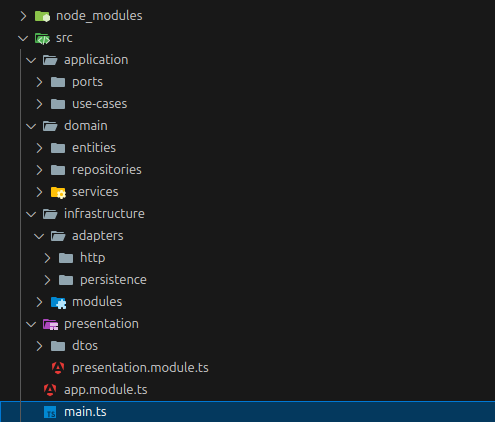
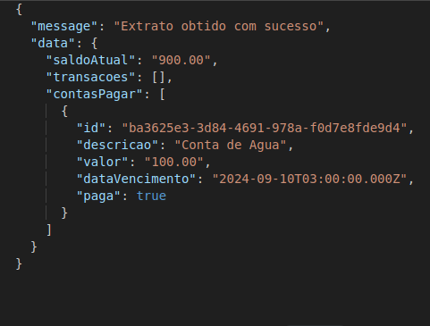
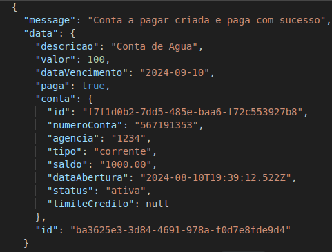
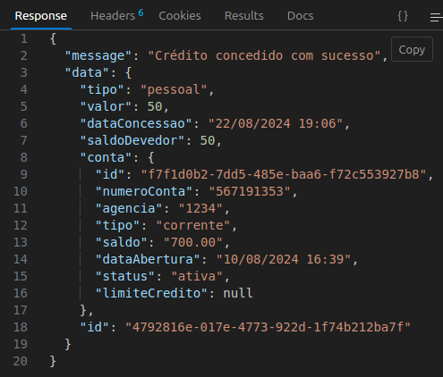
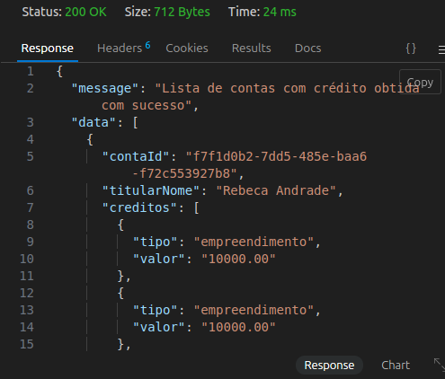

# Banco Comunitário


Este projeto é uma aplicação de gerenciamento bancário que implementa funcionalidades de criação de contas, gerenciamento de clientes e transações financeiras, incluindo depósitos, saques e transferências. A aplicação utiliza PostgreSQL como banco de dados relacional e TypeORM como ORM para facilitar a interação com o banco de dados.

## Arquitetura Hexagonal

O projeto utiliza a Arquitetura Hexagonal (também conhecida como Arquitetura de Portas e Adaptadores) para promover a separação de preocupações e tornar o sistema mais modular e testável. A arquitetura hexagonal divide a aplicação em três partes principais:

1. **Domínio**: Contém as regras de negócio e a lógica principal da aplicação.
2. **Aplicação**: Define os casos de uso e as interações entre o domínio e o mundo externo.
3. **Infraestrutura**: Implementa os adaptadores e interfaces para comunicação com sistemas externos, como bancos de dados, APIs, etc.




### Banco de Dados PostgreSQL e ORM

1. **Configuração do Banco de Dados PostgreSQL**
   - O banco de dados PostgreSQL foi configurado para armazenar informações sobre clientes, contas e transações.
   - A conexão com o banco de dados é gerenciada através do TypeORM, que facilita o mapeamento entre as entidades do banco de dados e as classes da aplicação.

2. **Integração com TypeORM**
   - TypeORM foi utilizado para gerenciar interações com o banco de dados, permitindo a criação e manipulação de entidades de forma intuitiva.
   - A configuração do TypeORM inclui a definição de entidades para `Cliente`, `Conta`, `Transacao`, e `Gerente`.

## Funcionalidades Implementadas

#### Gerenciamento de Clientes

- **Criar Cliente**
  - Rota: `POST /clientes`
  - Descrição: Cria um novo cliente no sistema.
  
- **Listar Clientes**
  - Rota: `GET /clientes`
  - Descrição: Retorna todos os clientes cadastrados.

- **Atualizar Cliente**
  - Rota: `PUT /clientes/:id`
  - Descrição: Atualiza as informações de um cliente existente.

- **Deletar Cliente**
  - Rota: `DELETE /clientes/:id`
  - Descrição: Remove um cliente do sistema.

#### Gerenciamento de Contas

- **Criar Conta**
  - Rota: `POST /contas`
  - Descrição: Cria uma nova conta bancária associada a um cliente.
  
- **Listar Contas**
  - Rota: `GET /contas`
  - Descrição: Retorna todas as contas cadastradas.

- **Consultar Conta**
  - Rota: `GET /contas/:id`
  - Descrição: Retorna os detalhes de uma conta específica.

- **Deletar Conta**
  - Rota: `DELETE /contas/:id`
  - Descrição: Remove uma conta do sistema.

#### Transações Financeiras

- **Depósito**
  - Rota: `POST /contas/:id/depositar`
  - Descrição: Realiza um depósito em uma conta.

- **Saque**
  - Rota: `POST /contas/:id/sacar`
  - Descrição: Realiza um saque de uma conta.

- **Transferência**
  - Rota: `POST /contas/:id/transferir`
  - Descrição: Transfere fundos de uma conta para outra.

#### Extrato de Transações

- **Consultar Extrato**
  - Rota: `GET /contas/:id/extrato`
  - Descrição: Retorna o extrato de transações de uma conta específica, incluindo depósitos, saques e transferências.
   ##### Exemplo:

    

 #### Pagar Contas 
 - Rota: `POST /contas/{id-da-conta}/conta-pagar`
 - Descrição: Assim que a conta a pagar é criada, o sistema deduz o valor do saldo da conta do cliente e marca a conta como paga.
  ##### Exemplo:

 


 #### Crédito para Financiamento e Consumo

   - **Conceder Crédito**
      - Rota: `POST /contas/:id/creditos`
      -  Descrição: Concede crédito a uma conta específica, que pode ser utilizado para financiamento de empreendimentos solidários ou para consumo pessoal e familiar. A funcionalidade permite registrar um crédito no sistema, especificando o tipo de crédito (empreendimento ou pessoal) e o valor concedido.
        O crédito concedido será registrado com a data de concessão e um saldo devedor igual ao valor concedido, que será associado à conta especificada.

  ##### Exemplo:

 

  #### Gerente - Listar Contas com Créditos

    
  - **Visualizar Lista de Créditos**
      - Rota: `GET /gerentes/contas-com-credito`
      -  Descrição: Retorna uma lista de contas que possuem créditos concedidos. Essa lista inclui o nome do titular da conta, o tipo de crédito e o valor associado a cada crédito. Apenas gerentes têm acesso a essa funcionalidade para monitoramento e gestão dos créditos concedidos.

 


## Tecnologias Utilizadas

- **Node.js**: Plataforma de desenvolvimento.
- **NestJS**: Framework para construção de aplicações Node.js eficientes e escaláveis.
- **PostgreSQL**: Banco de dados relacional utilizado para armazenamento de dados.
- **TypeORM**: ORM (Object-Relational Mapping) utilizado para interagir com o banco de dados de forma simplificada.


## Instalação

1. Clone o repositório:

    ```bash
    git clone https://github.com/MayaraRocha95/banco-comunitario-projeto
    ```

2. Navegue até o diretório do projeto:

    ```bash
    cd banco-comunitario-projeto
    ```

3. Instale as dependências:

    ```bash
    npm install
    ```

## Execução

Para iniciar o servidor de desenvolvimento:

```bash
npm run start:dev
```
Projeto Criado por Mayara Rocha durante Imersão Avançado de Back-End da [Reprograma](https://reprograma.com.br/)
